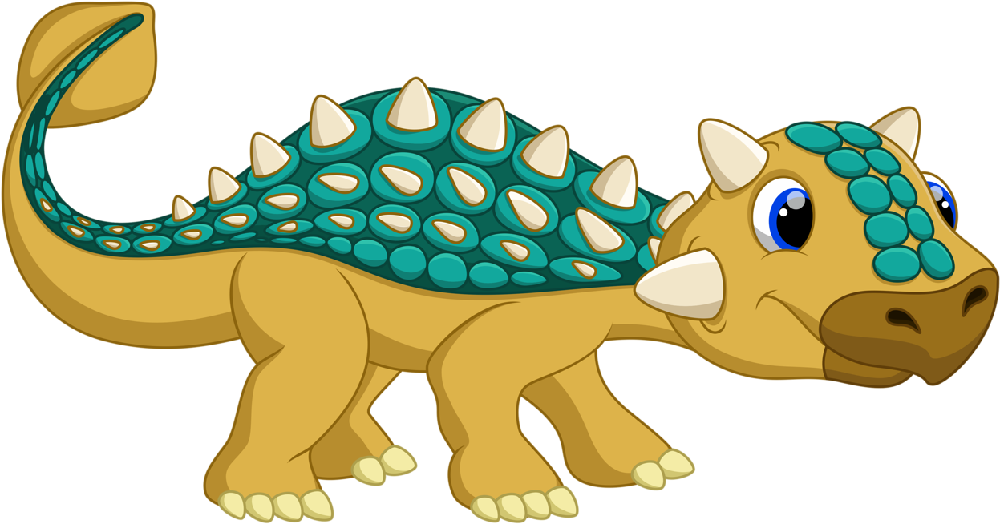
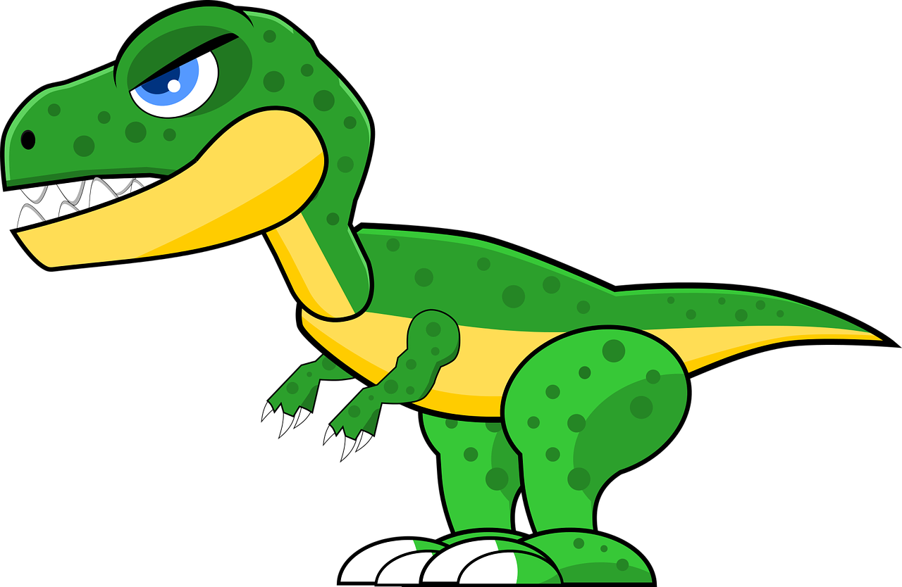
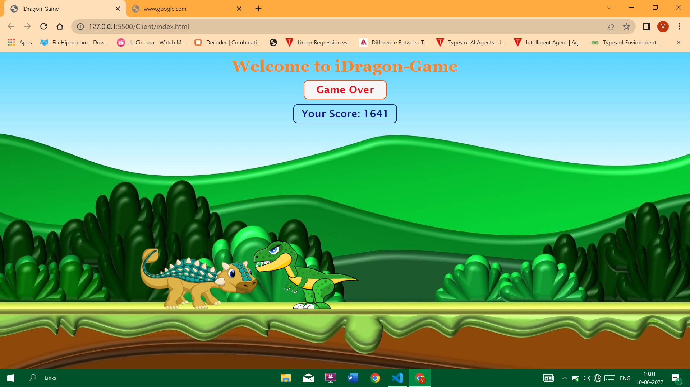

# IDragon-Game

we will make an interesting game named iDragon. We will make this possible with the help of HTML, CSS, and pure Javascript without any external library.  We will add music, animation, score features, etc in this game and code this game in a way where you can challenge your friends to play and break your score. 

Surely you will get addicted to playing your own coded game.

This is Silvisaurus which have to defence itself from T-Rex attack.

This is T-Rex Which will attack on Silvisaurus.

Once you Jump and cross the T-Rex your score will increase by 1. If T-Rex attacks on you and you are unable to save yourself from attack then game will over. On the Screen you will get a message as a GAME OVER and below show your GAME SCORE.

